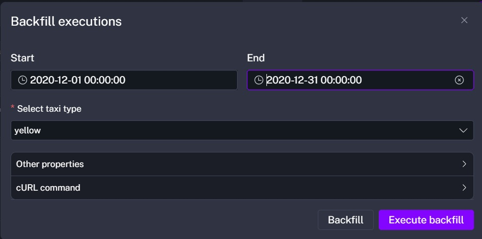
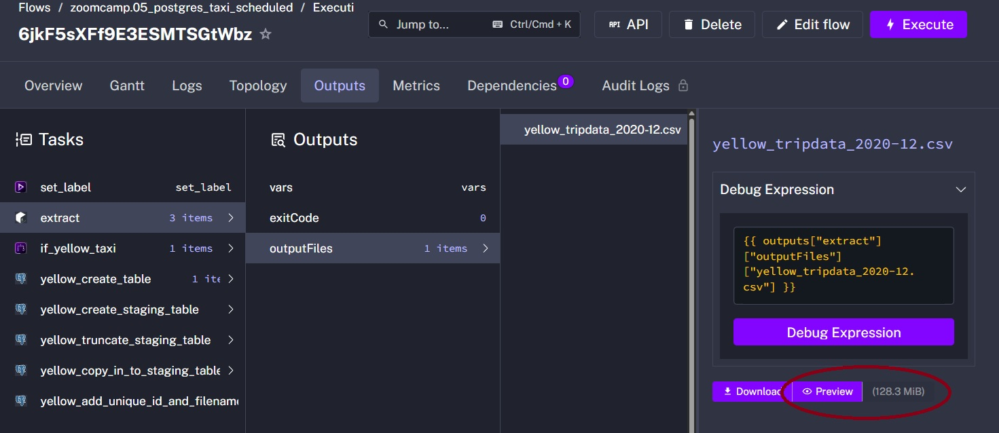

# Data Engineering Zoomcamp 2026 - Week 2 Homework
**Orchestration Tool:** Kestra  
**Database:** Postgres (Dockerized)  
**Environment:** GitHub Codespaces

---

## Homework Answers

**Q1**: **128.3 MiB** 

**Q2**: **green_tripdata_2020-04.csv**

**Q3**: **24,648,499** 

**Q4**: **1,734,051** 

**Q5**: **1,925,152** 

**Q6**: **America/New_York** 

---


<details>
<summary>Click to view Docker Compose Configuration</summary>

```yaml
volumes:
  ny_taxi_postgres_data:
    driver: local
  kestra_postgres_data:
    driver: local
  kestra_data:
    driver: local

services:

  pgdatabase:
    image: postgres:16  # <--- CHANGED from 18 to 13 to 16
    environment:
      POSTGRES_USER: root
      POSTGRES_PASSWORD: root
      POSTGRES_DB: ny_taxi
    ports:
      - "5432:5432"
    volumes:
      - ny_taxi_postgres_data:/var/lib/postgresql/data
    depends_on:
      kestra:
        condition: service_started

  pgadmin:
    image: dpage/pgadmin4
    environment:
      PGADMIN_DEFAULT_EMAIL: admin@admin.com
      PGADMIN_DEFAULT_PASSWORD: root
    ports:
      - "8085:80"
    depends_on:
      pgdatabase:
        condition: service_started

  kestra_postgres:
    image: postgres:18 
    volumes:
      - kestra_postgres_data:/var/lib/postgresql
    environment:
      POSTGRES_DB: kestra
      POSTGRES_USER: kestra
      POSTGRES_PASSWORD: k3str4
    healthcheck:
      test: ["CMD-SHELL", "pg_isready -d $${POSTGRES_DB} -U $${POSTGRES_USER}"]
      interval: 30s
      timeout: 10s
      retries: 10

  kestra:
    image: kestra/kestra:v1.1
    pull_policy: always
    user: "root"
    command: server standalone
    volumes:
      - kestra_data:/app/storage
      - /var/run/docker.sock:/var/run/docker.sock 
      - /tmp/kestra-wd:/tmp/kestra-wd
    environment:
      KESTRA_CONFIGURATION: |
        datasources:
          postgres:
            url: jdbc:postgresql://kestra_postgres:5432/kestra
            driverClassName: org.postgresql.Driver
            username: kestra
            password: k3str4
        kestra:
          server:
            basicAuth:
              username: "admin@kestra.io"
              password: Admin1234!
          repository:
            type: postgres
          storage:
            type: local
            local:
              basePath: "/app/storage"
          queue:
            type: postgres
          tasks:
            tmpDir:
              path: /tmp/kestra-wd/tmp
          url: http://localhost:8080/
    ports:
      - "8080:8080"
    depends_on:
      kestra_postgres:
        condition: service_started
```
   
</details>

---
<details>
<summary>Click to view modified 05_postgres-taxi-scheduled YAML</summary>

```yaml
id: 05_postgres_taxi_scheduled
namespace: zoomcamp
description: |
  Best to add a label `backfill:true` from the UI to track executions created via a backfill.
  CSV data used here comes from: https://github.com/DataTalksClub/nyc-tlc-data/releases

concurrency:
  limit: 1

inputs:
  - id: taxi
    type: SELECT
    displayName: Select taxi type
    values: [yellow, green]
    defaults: yellow

variables:
  file: "{{inputs.taxi}}_tripdata_{{trigger.date | date('yyyy-MM')}}.csv"
  staging_table: "public.{{inputs.taxi}}_tripdata_staging"
  table: "public.{{inputs.taxi}}_tripdata"
  data: "{{outputs.extract.outputFiles[inputs.taxi ~ '_tripdata_' ~ (trigger.date | date('yyyy-MM')) ~ '.csv']}}"

tasks:
  - id: truncate_staging
    type: io.kestra.plugin.jdbc.postgresql.Queries
    url: jdbc:postgresql://pgdatabase:5432/ny_taxi
    username: root
    password: root
    sql: |
      TRUNCATE TABLE public.yellow_tripdata_staging;

  - id: set_label
    type: io.kestra.plugin.core.execution.Labels
    labels:
      file: "{{render(vars.file)}}"
      taxi: "{{inputs.taxi}}"

  - id: extract
    type: io.kestra.plugin.scripts.shell.Commands
    outputFiles:
      - "*.csv"
    taskRunner:
      type: io.kestra.plugin.core.runner.Process
    commands:
      - wget -qO- https://github.com/DataTalksClub/nyc-tlc-data/releases/download/{{inputs.taxi}}/{{render(vars.file)}}.gz | gunzip > {{render(vars.file)}}

  - id: if_yellow_taxi
    type: io.kestra.plugin.core.flow.If
    condition: "{{inputs.taxi == 'yellow'}}"
    then:
      - id: yellow_create_table
        type: io.kestra.plugin.jdbc.postgresql.Queries
        sql: |
          CREATE TABLE IF NOT EXISTS {{render(vars.table)}} (
              unique_row_id          text,
              filename               text,
              VendorID               text,
              tpep_pickup_datetime   timestamp,
              tpep_dropoff_datetime  timestamp,
              passenger_count        integer,
              trip_distance          double precision,
              RatecodeID             text,
              store_and_fwd_flag     text,
              PULocationID           text,
              DOLocationID           text,
              payment_type           integer,
              fare_amount            double precision,
              extra                  double precision,
              mta_tax                double precision,
              tip_amount             double precision,
              tolls_amount           double precision,
              improvement_surcharge  double precision,
              total_amount           double precision,
              congestion_surcharge   double precision
          );

      - id: yellow_create_staging_table
        type: io.kestra.plugin.jdbc.postgresql.Queries
        sql: |
          CREATE TABLE IF NOT EXISTS {{render(vars.staging_table)}} (
              unique_row_id          text,
              filename               text,
              VendorID               text,
              tpep_pickup_datetime   timestamp,
              tpep_dropoff_datetime  timestamp,
              passenger_count        integer,
              trip_distance          double precision,
              RatecodeID             text,
              store_and_fwd_flag     text,
              PULocationID           text,
              DOLocationID           text,
              payment_type           integer,
              fare_amount            double precision,
              extra                  double precision,
              mta_tax                double precision,
              tip_amount             double precision,
              tolls_amount           double precision,
              improvement_surcharge  double precision,
              total_amount           double precision,
              congestion_surcharge   double precision
          );

      - id: yellow_truncate_staging_table
        type: io.kestra.plugin.jdbc.postgresql.Queries
        sql: |
          TRUNCATE TABLE {{render(vars.staging_table)}};

      - id: yellow_copy_in_to_staging_table
        type: io.kestra.plugin.jdbc.postgresql.CopyIn
        format: CSV
        from: "{{render(vars.data)}}"
        table: "{{render(vars.staging_table)}}"
        header: true
        columns: [VendorID,tpep_pickup_datetime,tpep_dropoff_datetime,passenger_count,trip_distance,RatecodeID,store_and_fwd_flag,PULocationID,DOLocationID,payment_type,fare_amount,extra,mta_tax,tip_amount,tolls_amount,improvement_surcharge,total_amount,congestion_surcharge]

      - id: yellow_add_unique_id_and_filename
        type: io.kestra.plugin.jdbc.postgresql.Queries
        sql: |
          UPDATE {{render(vars.staging_table)}}
          SET 
            unique_row_id = md5(
              COALESCE(CAST(VendorID AS text), '') ||
              COALESCE(CAST(tpep_pickup_datetime AS text), '') || 
              COALESCE(CAST(tpep_dropoff_datetime AS text), '') || 
              COALESCE(PULocationID, '') || 
              COALESCE(DOLocationID, '') || 
              COALESCE(CAST(fare_amount AS text), '') || 
              COALESCE(CAST(trip_distance AS text), '')      
            ),
            filename = '{{render(vars.file)}}';

      - id: yellow_merge_data
        type: io.kestra.plugin.jdbc.postgresql.Queries
        sql: |
          MERGE INTO {{render(vars.table)}} AS T
          USING {{render(vars.staging_table)}} AS S
          ON T.unique_row_id = S.unique_row_id
          WHEN NOT MATCHED THEN
            INSERT (
              unique_row_id, filename, VendorID, tpep_pickup_datetime, tpep_dropoff_datetime,
              passenger_count, trip_distance, RatecodeID, store_and_fwd_flag, PULocationID,
              DOLocationID, payment_type, fare_amount, extra, mta_tax, tip_amount, tolls_amount,
              improvement_surcharge, total_amount, congestion_surcharge
            )
            VALUES (
              S.unique_row_id, S.filename, S.VendorID, S.tpep_pickup_datetime, S.tpep_dropoff_datetime,
              S.passenger_count, S.trip_distance, S.RatecodeID, S.store_and_fwd_flag, S.PULocationID,
              S.DOLocationID, S.payment_type, S.fare_amount, S.extra, S.mta_tax, S.tip_amount, S.tolls_amount,
              S.improvement_surcharge, S.total_amount, S.congestion_surcharge
            );

  - id: if_green_taxi
    type: io.kestra.plugin.core.flow.If
    condition: "{{inputs.taxi == 'green'}}"
    then:
      - id: green_create_table
        type: io.kestra.plugin.jdbc.postgresql.Queries
        sql: |
          CREATE TABLE IF NOT EXISTS {{render(vars.table)}} (
              unique_row_id          text,
              filename               text,
              VendorID               text,
              lpep_pickup_datetime   timestamp,
              lpep_dropoff_datetime  timestamp,
              store_and_fwd_flag     text,
              RatecodeID             text,
              PULocationID           text,
              DOLocationID           text,
              passenger_count        integer,
              trip_distance          double precision,
              fare_amount            double precision,
              extra                  double precision,
              mta_tax                double precision,
              tip_amount             double precision,
              tolls_amount           double precision,
              ehail_fee              double precision,
              improvement_surcharge  double precision,
              total_amount           double precision,
              payment_type           integer,
              trip_type              integer,
              congestion_surcharge   double precision
          );

      - id: green_create_staging_table
        type: io.kestra.plugin.jdbc.postgresql.Queries
        sql: |
          CREATE TABLE IF NOT EXISTS {{render(vars.staging_table)}} (
              unique_row_id          text,
              filename               text,
              VendorID               text,
              lpep_pickup_datetime   timestamp,
              lpep_dropoff_datetime  timestamp,
              store_and_fwd_flag     text,
              RatecodeID             text,
              PULocationID           text,
              DOLocationID           text,
              passenger_count        integer,
              trip_distance          double precision,
              fare_amount            double precision,
              extra                  double precision,
              mta_tax                double precision,
              tip_amount             double precision,
              tolls_amount           double precision,
              ehail_fee              double precision,
              improvement_surcharge  double precision,
              total_amount           double precision,
              payment_type           integer,
              trip_type              integer,
              congestion_surcharge   double precision
          );

      - id: green_truncate_staging_table
        type: io.kestra.plugin.jdbc.postgresql.Queries
        sql: |
          TRUNCATE TABLE {{render(vars.staging_table)}};

      - id: green_copy_in_to_staging_table
        type: io.kestra.plugin.jdbc.postgresql.CopyIn
        format: CSV
        from: "{{render(vars.data)}}"
        table: "{{render(vars.staging_table)}}"
        header: true
        columns: [VendorID,lpep_pickup_datetime,lpep_dropoff_datetime,store_and_fwd_flag,RatecodeID,PULocationID,DOLocationID,passenger_count,trip_distance,fare_amount,extra,mta_tax,tip_amount,tolls_amount,ehail_fee,improvement_surcharge,total_amount,payment_type,trip_type,congestion_surcharge]

      - id: green_add_unique_id_and_filename
        type: io.kestra.plugin.jdbc.postgresql.Queries
        sql: |
          UPDATE {{render(vars.staging_table)}}
          SET 
            unique_row_id = md5(
              COALESCE(CAST(VendorID AS text), '') ||
              COALESCE(CAST(lpep_pickup_datetime AS text), '') || 
              COALESCE(CAST(lpep_dropoff_datetime AS text), '') || 
              COALESCE(PULocationID, '') || 
              COALESCE(DOLocationID, '') || 
              COALESCE(CAST(fare_amount AS text), '') || 
              COALESCE(CAST(trip_distance AS text), '')      
            ),
            filename = '{{render(vars.file)}}';

      - id: green_merge_data
        type: io.kestra.plugin.jdbc.postgresql.Queries
        sql: |
          MERGE INTO {{render(vars.table)}} AS T
          USING {{render(vars.staging_table)}} AS S
          ON T.unique_row_id = S.unique_row_id
          WHEN NOT MATCHED THEN
            INSERT (
              unique_row_id, filename, VendorID, lpep_pickup_datetime, lpep_dropoff_datetime,
              store_and_fwd_flag, RatecodeID, PULocationID, DOLocationID, passenger_count,
              trip_distance, fare_amount, extra, mta_tax, tip_amount, tolls_amount, ehail_fee,
              improvement_surcharge, total_amount, payment_type, trip_type, congestion_surcharge
            )
            VALUES (
              S.unique_row_id, S.filename, S.VendorID, S.lpep_pickup_datetime, S.lpep_dropoff_datetime,
              S.store_and_fwd_flag, S.RatecodeID, S.PULocationID, S.DOLocationID, S.passenger_count,
              S.trip_distance, S.fare_amount, S.extra, S.mta_tax, S.tip_amount, S.tolls_amount, S.ehail_fee,
              S.improvement_surcharge, S.total_amount, S.payment_type, S.trip_type, S.congestion_surcharge
            );
  
  - id: purge_files
    type: io.kestra.plugin.core.storage.PurgeCurrentExecutionFiles
    description: To avoid cluttering your storage, we will remove the downloaded files

pluginDefaults:
  - type: io.kestra.plugin.jdbc.postgresql
    values:
      url: jdbc:postgresql://pgdatabase:5432/ny_taxi
      username: root
      password: root

triggers:
  - id: green_schedule
    type: io.kestra.plugin.core.trigger.Schedule
    cron: "0 9 1 * *"
    inputs:
      taxi: green

  - id: yellow_schedule
    type: io.kestra.plugin.core.trigger.Schedule
    cron: "0 10 1 * *"
    inputs:
      taxi: yellow
```

</details>

---

### Question 1: Uncompressed File Size of Yellow Taxi data for Dec. 2020

- The first step was to use Kestra to do a backfill on the Yellow taxi data for December 2020:


- Next, I went to the Excutions tab $\rightarrow$ Outputs $\rightarrow$ Tasks $\rightarrow$ `extract` $\rightarrow$ `outputFiles`: **128.3 MiB**



### Question 2: Rendered Variable
Testing Kestra's expression engine with inputs: `taxi: green`, `year: 2020`, `month: 04`.  
The rendered string follows the pattern: 
`{{inputs.taxi}}_tripdata_{{inputs.year}}-{{inputs.month}}.csv`

### Question 3
### 🔄 Iterative Ingestion Strategy
Due to infrastructure constraints (Codespaces Disk Quota), the 2020 backfill was refactored into quarterly batches:
- **Strategy:** 3-month rolling windows.
- **Cleanup:** Atomic TRUNCATE on staging and automated Purge on local storage.
- **Outcome:** Successful ingestion of 24.6M+ records without system failure.

```sql
SELECT count(*) 
FROM public.yellow_tripdata 
WHERE filename LIKE 'yellow_tripdata_2020%';
```

### Question 4

```sql
SELECT count(*) 
FROM public.green_tripdata 
WHERE filename LIKE 'green_tripdata_2020%';
```

### Question 5 
```sql
SELECT count(*) 
FROM public.yellow_tripdata 
WHERE filename = 'yellow_tripdata_2021-03.csv';
```

### Question 6

```yaml
triggers:
  - id: daily_schedule
    type: io.kestra.plugin.core.trigger.Schedule
    cron: "0 9 * * *" # Runs at 9:00 AM
    timezone: America/New_York # Ensures 9 AM NY time regardless of DST
```