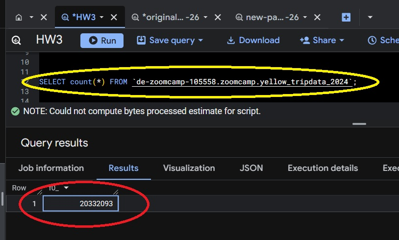
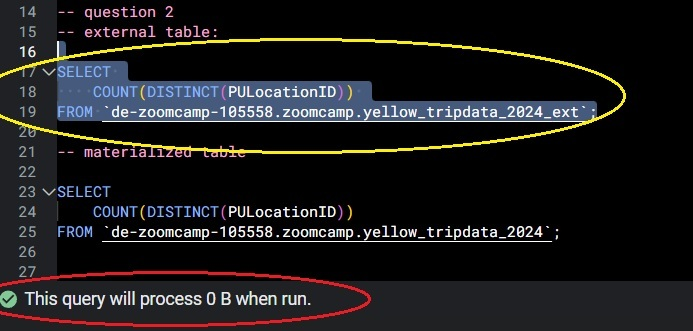
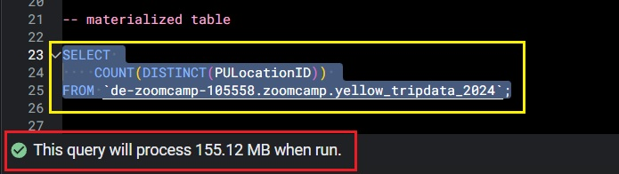
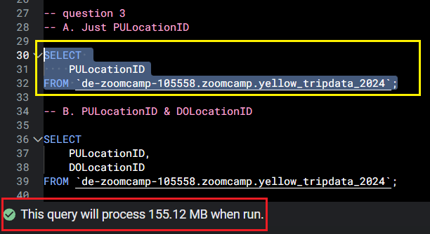
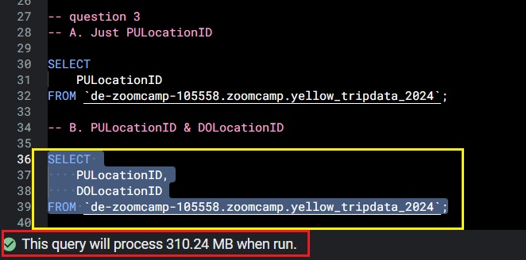
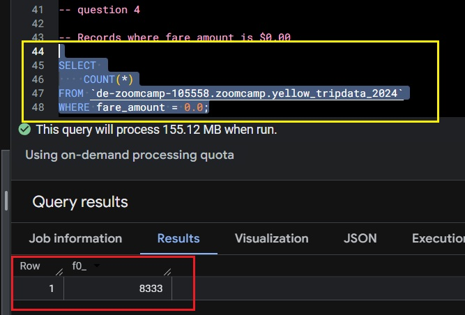
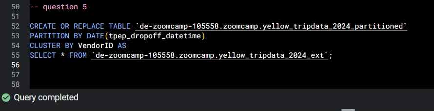
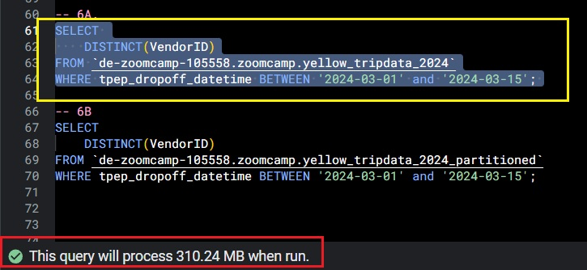
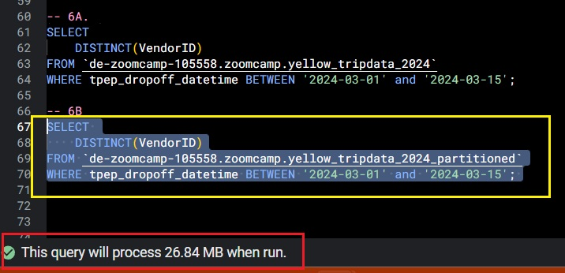
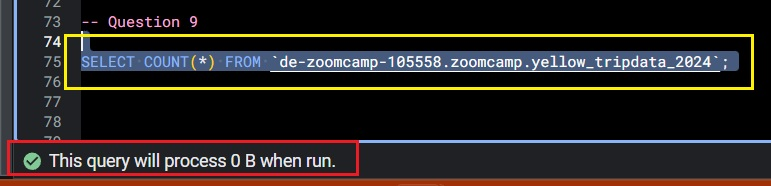

# Data Engineering Zoomcamp 2026 - Week 3 Homework
**Orchestration Tool:** Kestra
**Database:** Google Cloud Storage
**Environment:** GitHub Codespaces

## Homework Answers (Work, Screenshots, and Explanations below)

**Q1**: 20,332,093

**Q2**: 0 MB for the External Table and 155.12 MB for the Materialized Table 

**Q3**: BigQuery is columnar, only selected columns are scanned

**Q4**: 8,333

**Q5**: Partition by tpep_dropoff_datetime and Cluster on VendorID

**Q6**: Non-Partitioned $\approx$ 310MB | Partioned $\approx$ 26MB

**Q7**: Google Cloud Storage **Bucket**

**Q8**: True

**Q9**: 0MB

## Question 1. Counting records

What is count of records for the 2024 Yellow Taxi Data?
- 65,623
- 840,402
- 20,332,093 $\leftarrow$ **answer** 
- 85,431,289

## Question 2. Data read estimation

Write a query to count the distinct number of PULocationIDs for the entire dataset on both the tables.
 
What is the **estimated amount** of data that will be read when this query is executed on the External Table and the Table?

- 18.82 MB for the External Table and 47.60 MB for the Materialized Table
- 0 MB for the External Table and 155.12 MB for the Materialized Table $\leftarrow$ **answer**
- 2.14 GB for the External Table and 0MB for the Materialized Table
- 0 MB for the External Table and 0MB for the Materialized Table

### 2A.External Table Estimation

### 2B. Regular Table Estimation

## Question 3. Understanding columnar storage

Write a query to retrieve the PULocationID from the table (not the external table) in BigQuery. Now write a query to retrieve the PULocationID and DOLocationID on the same table.

Why are the estimated number of Bytes different?
- BigQuery is a columnar database, and it only scans the specific columns requested in the query. Querying two columns (PULocationID, DOLocationID) requires 
reading more data than querying one column (PULocationID), leading to a higher estimated number of bytes processed. $\leftarrow$ **answer**
- BigQuery duplicates data across multiple storage partitions, so selecting two columns instead of one requires scanning the table twice, 
doubling the estimated bytes processed.
- BigQuery automatically caches the first queried column, so adding a second column increases processing time but does not affect the estimated bytes scanned.
- When selecting multiple columns, BigQuery performs an implicit join operation between them, increasing the estimated bytes processed

### 3A. <u>PULocationID</u> Column Only Estimate

### 3B. <u>PULocationID</u> *&* <u>DOLocationID</u> Cols Estimate

## Question 4. Counting zero fare trips

How many records have a fare_amount of 0?
- 128,210
- 546,578
- 20,188,016
- 8,333 $\leftarrow$ **answer**

## Question 5. Partitioning and clustering

What is the best strategy to make an optimized table in Big Query if your query will always filter based on tpep_dropoff_datetime and order the results by VendorID (Create a new table with this strategy)

- Partition by tpep_dropoff_datetime and Cluster on VendorID $\leftarrow$ **answer**
- Cluster on by tpep_dropoff_datetime and Cluster on VendorID 
- Cluster on tpep_dropoff_datetime Partition by VendorID
- Partition by tpep_dropoff_datetime and Partition by VendorID

*We Partition on <u>tpep_dropoff_datetime</u> as it has a reasonalble cardinality and we can filter on that column. VendorID, on the other hand, will be used for sorting, so is an ideal candidate for Clustering*

### Partitioned & Clustered DDL

## Question 6. Partition benefits

Write a query to retrieve the distinct VendorIDs between tpep_dropoff_datetime
2024-03-01 and 2024-03-15 (inclusive)

- 12.47 MB for non-partitioned table and 326.42 MB for the partitioned table
- 310.24 MB for non-partitioned table and 26.84 MB for the partitioned table $\leftarrow$ **Answer** 
- 5.87 MB for non-partitioned table and 0 MB for the partitioned table
- 310.31 MB for non-partitioned table and 285.64 MB for the partitioned table

### Non-Partitinoned Estimation

### Partioned Table Estimation

## Question 7. External table storage

Where is the data stored in the External Table you created?

- Big Query
- Container Registry
- GCP Bucket $\leftarrow$ **Answer**
- Big Table

*The data remains in the <u>GCP Storage Bucket</u>. The external table in BigQuery points to the Parquet files in the bucket.*

## Question 8. Clustering best practices

It is best practice in Big Query to always cluster your data:
- True $\leftarrow$ **Answer**
- False 

*True. Not always strictly required but it requires no manual maintenance and optimizes query performance. It also does increase storage costs*

## Question 9. Understanding table scans

No Points: Write a `SELECT count(*)` query FROM the materialized table you created. How many bytes does it estimate will be read? Why?

**Answer** 0MB - BigQuery can access the row count from the metadata.

